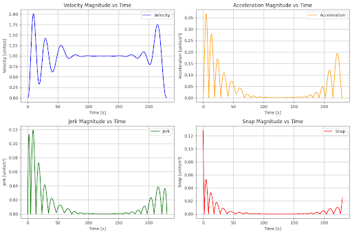

# Integrated Path and Trajectory Planning System for Autonomous Quadcopters Operating in Obstacle-Dense Urban Outdoor Settings

## The Overview of the Integrated Path and Trajectory Planning System
I have designed an integrated path and trajectory planning system in C++, well-suited for autonomous quadcopters operating in large outdoor obstacle-dense urban environments, that is modular, well-balanced in terms of performance and accuracy, adaptable to various configurations, and capable of reliably producing near-shortest-distance, collision-free, and smooth time-based trajectories between any two given positions on large 3D bounding-box obstacle maps. 

## The Architecture of the Integrated Path and Trajectory Planning System
The integrated path and trajectory planning system–which takes, as input, a CSV file specifying obstacle bounding box locations–comprises four main subsystems, which work together to produce, depending on which is desired, either a position-only waypoint sequence or a time-based sequence of waypoints.

## The Obstacle Processing Subsystem
The system’s obstacle data processing subsystem processes the input obstacle geometry CSV file via the ObstacleData class, which employs methods to parse the CSV file for key features, saving these to memory, and which provides methods to check the obstacle set for collisions against query points. The obstacle data processor structures obstacle geometry information using a KDTree data structure, which makes these spatial query operations more efficient, reducing them from O(N) operations to O(ln(N)) operations. 


**Figure 1.** The integrated path and trajectory planning system is designed to plan waypoint paths and trajectory plans for quadcopters operating in outdoor urban environments. This particular environment, a San Francisco city block, was used to aid in development of the planning system, and the obstacle map associated with this environment is included in the repository for this project. 


**Figure 2.** The integrated path and trajectory planning system is designed to operate on maps representing city sections, such as the one included in this repository, which measures 900 m x 900 m x 200 m total volume, features a large volume of obstacles (buildings and trees), and has many narrow passageways (above roadways), and altogether could be characterized as having an inherent grid-like or array-like topology. 


**Figure 3.** The integrated path and trajectory planning system’s obstacle processing submodule requires obstacle data to be pre-processed such that whole-object obstacles (i.e. trees and buildings) are represented by the joining together of one or more subvolume boxes in R3. This discretization structure is illustrated in the figure shown here. 

For mathematical context, the integrated path and trajectory planning system assumes the following relationship between space occupied by the environment, space occupied by obstacles, and space unoccupied by obstacles, also known as free space. 

The space occupied by the entire map is represented by the set of all points in $R^3$ bounded by the limits of the input obstacle geometry. 

<p align="center">
  
</p>

The space represented by each obstacle subvolume is represented by the set of all the points it bounds. 

<p align="center">
  
</p>

In this formulation, $(x_{c,i}, y_{c,i}, z_{c,i})$ denotes the center coordinate of the obstacle's bounding box and $h_{x,i}, h_{y,i}, h_{z,i}$ represent the halfwidths along the $x$-, $y$-, and $z$-axes, respectively.

The space occupied by all obstacles is represented by the joining together, or union, of all obstacle subvolumes. 

$$
O = O_1 \cup O_2 \cup \dots \cup O_n.
$$

Free space is represented by the set of all points in the environment but not in any obstacle subvolume. 
	
$$
F = E \setminus O.
$$

## The Path Planning Subsystems
The integrated path and trajectory planning system has two main modules dedicated to determining direct, collision-free, position-only waypoint sequences, one for long-distance pathfinding, that is global pathfinding, or pathfinding between positions spaced more than 100 m apart, and one for pathfinding between positions spaced closer together, also known as local pathfinding.

### The Global Path Planning Subsystem
The global pathfinding module works by first constructing, and saving to memory, a bi-directional graph data structure to broadly and uniformly represent free space (non-obstacle space), then, using the well-established A* search algorithm, searching this construction for a shortest-distance path between two desired positions, start and goal. The module functions as a multi-query planner, with the graph of free space meant to be created only one time and the search functionality to be called repeatedly against the generated graph structure.

The module’s FreeSpaceGraph class, which encapsulates both the module’s graph building and the module’s graph searching functionality, contains a method called generateGraph, which constructs the graph, forming it in the shape of a cubic-lattice, with nodes representing points in free space and edges representing collision-free navigable routes. Edge-length is a parameter, serving as a control on the resolution of the graph structure. The method connects each graph node to, at most, six of its cubic-lattice neighbors. The searchGraph method of the FreeSpaceClass encapsulates an implementation of the A* algorithm and will return the shortest-distance path, to the resolution of the constructed cubic-lattice, when provided with a non-obstacle start point and a non-obstacle goal point, or it will provide an empty path otherwise.

Like the obstacle processing module, the global planning module also employs the KDTree data structure to enhance performance of its key operations, namely edge creation and edge validation, which occur after the module has determined valid locations for all of the nodes of the free space graph. In edge creation, the module is determining the six neighbor nodes to each free space graph node. In edge validation, the module discretizes each edge into a sequence of test points along the line segment connecting the edge’s nodes, then checks each of these test points for collision with obstacles. By leveraging access to the KDTree of obstacle positions created by the obstacle processing module and by organizing all the free space nodes in a second KDTree, the global planning module performs both the edge creation and edge validation steps in $O(N ln(N))$ time complexity, which represents a reduction compared to the brute force $O(N^2)$ alternative. 


**Figure 4.** This visualization shows the result of the integrated path and trajectory planner’s global planning subsystem’s graph creation process. The graph represents a cubic-lattice geometrical structure, with the nodes of the graph representing points in free space and the edges of the graph representing the collision-free navigable routes between neighboring nodes. 


**Figure 5.** This visualization typifies the result of the integrated path and trajectory planner’s global planning subsystem’s A* pathfinding routine. The computed path will always be shortest-distance with respect to the resolution of the free space graph. In the visualization, the path is highlighted in orange. 

### The Local Path Planning Subsystem
With the strength of global pathfinding module being its ability to rapidly query the map for feasible paths between far away points, another module, called the local pathfinding module, fills in the gaps, handling the task of finding more refined paths between subsequent waypoints of the generated global plans or handling what is called “dynamic replanning,” this being rapidly constructing paths to navigate around newfound obstacles that invalidate prior generated plans. 

The local planning module is centered around a custom implementation of the rapidly exploring random tree (RRT) algorithm, introduced by computer scientist and researcher Steven M. Lavalle. The RRT algorithm works by means of a stochastic process that finds a path between nearby waypoints. The custom implementation employs a goal bias parameter to promote fast convergence to the goal position. Since the RRT output path is generally jagged, not direct, the local pathfinding module employs a path shortcutting post-process step, with the result being collision-free paths that are also as direct as possible. Furthermore, the module employs a second post-process step to interpolate additional waypoints along each segment of the output path, spaced exactly 5 m apart for seamless integration with the trajectory planning subsystem. 


**Figure 6.** This visualization typifies computed results of the integrated path and trajectory planning’s local planning subsystem. The RRT algorithm will expand a search tree from the start node, shown in green, to the goal node, shown in red. The raw path from start to goal through the RRT search tree will almost always be jagged, which is why the local planning module employs post-processing to produce a shortcut path, shown in orange. A second post-process step, whose results are shown as a blue dashed line, enforces a consistent spacing between points. 
 
The local planning module’s entire functionality is encapsulated in its RRT class, which accepts as input a start and goal location as well as various RRT specific parameters, including stepSize, maxIterations, and goalBias. While the implementation provides reference values that perform reasonably well on the obstacle map provided in this repository, these parameters are meant to be tuned to achieve maximum performance, especially for maps other than this one. 

## The Trajectory Planning Subsystem
The trajectory planning subsystem treats the trajectory planning problem into a polynomial segmentation problem, with the trajectory as a whole modeled as a piecewise continuous function and with each segment of the trajectory modeled as a degree-seven polynomial. The mathematical challenge that the algorithm underlying the trajectory planning subsystem solves is the challenge of solving for all of the coefficients on all of the polynomial segments such that create a smooth and flyable trajectory that passes through each waypoint. If there are, in general, N input waypoints, then there are thus $N - 1$ trajectory segments and $8(N - 1)$ unknown coefficients to solve for. 

$$ 
\begin{aligned} x(t) &= 1 + 1\,t + 1\,t^2 + 1\,t^3 + 1\,t^4 + 1\,t^5 + 1\,t^6 + 1\,t^7, \\ x'(t) &= 0 + 1\,t + 2\,t^2 + 3\,t^3 + 4\,t^4 + 5\,t^5 + 6\,t^6 + 7\,t^7, \\ x''(t) &= 0 + 0\,t + 2\,t^2 + 6\,t^3 + 12\,t^4 + 20\,t^5 + 30\,t^6 + 42\,t^7, \\ x'''(t) &= 0 + 0\,t + 0\,t^2 + 6\,t^3 + 24\,t^4 + 60\,t^5 + 120\,t^6 + 210\,t^7, \\ x^{(4)}(t) &= 0 + 0\,t + 0\,t^2 + 0\,t^3 + 24\,t^4 + 120\,t^5 + 360\,t^6 + 840\,t^7, \\ x^{(5)}(t) &= 0 + 0\,t + 0\,t^2 + 0\,t^3 + 0\,t^4 + 120\,t^5 + 720\,t^6 + 2520\,t^7, \\ x^{(6)}(t) &= 0 + 0\,t + 0\,t^2 + 0\,t^3 + 0\,t^4 + 0\,t^5 + 720\,t^6 + 5040\,t^7. \end{aligned} 
$$

**Figure 7.** The integrated path and trajectory planner’s trajectory planning subsystem models trajectory segments as degree-seven polynomials. It solves for a feasible trajectory by building a system of linear algebraic equations that enforces constraints on position as well as the first six motion derivatives. 

The trajectory planning algorithm’s logic is focused on formulating a system of linear algebraic equations composed of exactly as many constraining equations as unknown coefficients. The first six independent constraints are tied to enforcing what are called “natural boundary conditions” at the first and last waypoint, that is the velocity, acceleration, and jerk are zeroed. Mathematically,

$$
x'(t_0^s) = 0,\quad x''(t_0^s) = 0,\quad x'''(t_0^s) = 0,\quad x'(t_{N-1}^e) = 0,\quad x''(t_{N-1}^e) = 0,\quad x'''(t_{N-1}^e) = 0.
$$

The next $N$ constraints come from fixing the position at each waypoint. Mathematically,

$$ 
\begin{aligned} x(t_0^s) &= x_0, \\ x(t_1^s) &= x_1, \\ &\quad\vdots \\ x(t_{N-1}^s) &= x_{N-1}. \end{aligned} 
$$

The remaining constraints, which count to $7 * (N - 2)$, come from enforcing continuity in position plus the first six motion derivatives of motion at each of the intermediate waypoints. Mathematically, 

$$
\begin{aligned}
x(t_0^e) &= x(t_1^s),\quad x(t_1^e) = x(t_2^s),\quad \ldots,\quad x(t_{N-2}^e) = x(t_{N-1}^s),\\[1mm]
x'(t_0^e) &= x'(t_1^s),\quad x'(t_1^e) = x'(t_2^s),\quad \ldots,\quad x'(t_{N-2}^e) = x'(t_{N-1}^s),\\[1mm]
&\quad\vdots\quad\vdots\quad\vdots\quad\vdots\\[1mm]
x^{(6)}(t_0^e) &= x^{(6)}(t_1^s),\quad x^{(6)}(t_1^e) = x^{(6)}(t_2^s),\quad \ldots,\quad x^{(6)}(t_{N-2}^e) = x^{(6)}(t_{N-1}^s).
\end{aligned}
$$

The trajectory planning module’s code develops the system of equations in a matrix form, leveraging the C++ matrix linear algebra library. The matrix equation has the form 

$$ 
\mathbf{M}\,\mathbf{c} = \mathbf{b},
$$

where $\mathbf{b}$ is the $8(N-1)$ column vector of constraints, $\mathbf{c}$ is the $8(N-1)$ column vector of unknown coefficients, and the $8(N-1)$ x $8 (N-1)$ $\mathbf{M}$ matrix is the linear transformation that maps the coefficient vector to the constraint vector. In the code, the `TrajectoryPlanner` class encapsulates the matrix assembly and matrix solving logic. The methods `assembleBoundaryMatrix`, `assembleWaypointMatrix`, and `assembleContinuityMatrix` assemble $\mathbf{M}$ from three submatrices, one for each of the three groupings of constraint equations. 

Once the trajectory module assembles the system of equations in this matrix form, it leverages Eigen’s built in matrix system solving tools to determine the unknown coefficients. Since waypoint information is three dimensional, the trajectory planning system actually formulates and solves such a system of equations three times, one for each spatial degree of freedom. Also, through a parameter called maxSpeed, the API allows for direct control of how much time is allocated to each trajectory segment. Time allocation is based on dividing the Euclidean distance between waypoints by whatever is five times less than maxSpeed–a heuristic calculation that has proven effective when generating trajectories from RRT outputs using standard settings but is also a heuristic calculation that can be further tuned for enhanced performance or customization. 


**Figure 8.** This figure shows the result of the trajectory planning operation applied to the waypoint plan produced by the integrated trajectory path and trajectory planners local path planning subsystem. Although obstacle bounding boxes have been removed from the visualization for simplicity, it is generally true that these trajectories are collision-free due to the nature of how RRT outputs are composed of only closely spaced non-obstacle waypoints. At this stage of the project, there are no logic or verification steps to handle exception cases, but these features could be added in future extensions of this project.



**Figure 9.** This figure shows the typical motion profile produced by the integrated path and trajectory planning system’s trajectory planning subsystem. These plots validate the fact that the module’s algorithm enforces continuity at intermediate waypoints and enforces a rest condition at the first and the final waypoints. While enforcing this many constraints was necessary to generate exactly as many independent equations as unknowns, the drawbacks are also evident in the oscillatory behavior that results.

## Putting the Integrated Path and Trajectory Planning System to the Test
I’ve taken steps to develop the integrated path and trajectory planning system incrementally, testing each module before I build the next. To aid in achieving this aim, I designed the system first in Python and only thereafter began to port it to C++. In C++, I’ve thus far been able to achieve these results, through Monte Carlo Simulations: 

- Average search time for A* search over 50 cases of 11 ms when free space graph nodes are configured having a 25 m separation distance, when free space graph nodes are configured as being 6-connected, and when the start and the goal node of the query configuration are separated by a minimum distance of 600 m and a maximum distance of 700 m. 
- Average RRT search time of 1.1 ms when the start and the goal nodes are between 45 m and 50 m apart. This execution time figure was further confirmed by adding a convergence step to the Monte Carlo sampling algorithm that enforced both a minimum number of trials, 100, and a 1% convergence requirement before simulation exit. 
 
## Take a Closer Look
### Clone the Repository
```git clone https://https://github.com/ronen-aniti-projects/Quadcopter-Planning-System```

### Download Dependencies
1. Download Eigen from Eigen’s official website, https://eigen.tuxfamily.org/, and follow the installation instructions.
2. The KDTree library (BSD 3-Clause License by J. Frederico Carvalho) is included in the include folder. 

### Compile the Project
```g++ -o trajectory_planner.exe main.cpp GlobalPlanning.cpp LocalPlanning.cpp TrajectoryPlanning.cpp ObstacleData.cpp include/KDTree.cpp -Iinclude/```

### Test It Out
Run the test scripts to assess the performance of all three components of the algorithm under various parameter settings. Experiment with modifying the planning parameters in `ObstacleData.cpp`, `GlobalPlanning.cpp`, and `TrajectoryPlanning.cpp`—such as the graph resolution, neighbor connectivity, RRT goal bias, and RRT step size—to understand their effects on performance.
